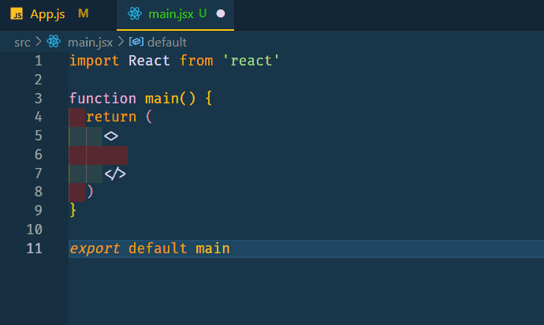

# React Sugar 🎉

# Introduction

Welcome to the React Sugar Suite, an exquisite collection of React snippets meticulously crafted for seamless integration into Visual Studio Code. Elevate your coding experience by utilizing these snippets to effortlessly insert classNames, both static and dynamic, through intuitive shortcut tag names.

# Overview

React Sugar simplifies and streamlines the process of incorporating classNames into your React components. It caters to developers using Visual Studio Code, offering a suite of snippets that are both efficient and elegant.

# Installation

To unlock the full potential of React Sugar, follow these simple steps:

<ol>
<li>
Install the React Sugar Extension from the Visual Studio Code Marketplace.</li>
<li>Once installed, the suite is ready to enhance your coding efficiency.</li>
</ol>

# How to use

Utilizing React Sugar snippets is a breeze. Just type the designated tag name along with a specific identifier for static or dynamic classNames:



## Supported tags

```
div
p
span
a
button
ul
ol
li
h1 to h6
input
textarea
img
svg
table
tbody
th
td
hr
thead
tfoot
select
section
pre
picture
option
optgroup
nav
main
iframe
form
footer
figure
caption
canvas
article
```
